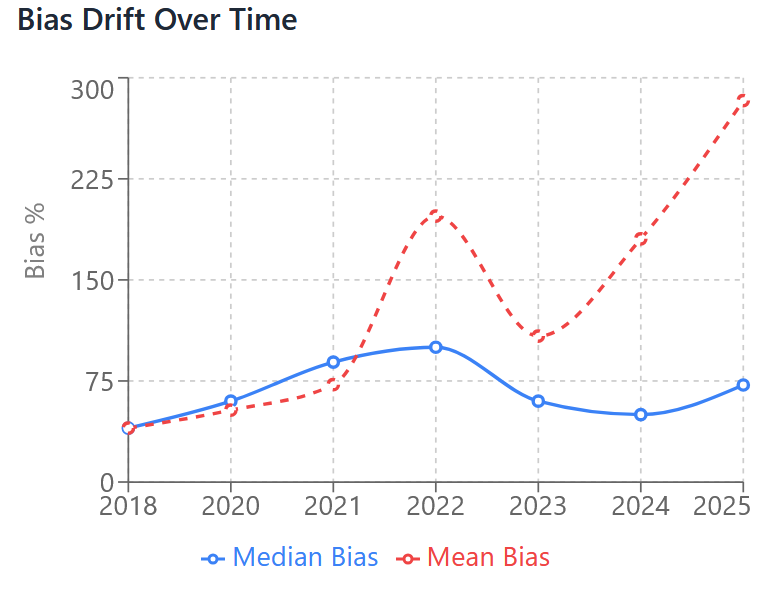

1/22/2026
Updated with 2nd CDI, independent replication 83%/355%

# conservative-bias-tracker
Institutional optimization against Type 1 errors has exploded Type 2 problem space.  Unassessed multi-domain interactions have hidden an ongoing cascade in earth and human systems.  Bias assessment of empirical observation vs institutional/theoretical forecasts reveals a consistent normalcy bias and emerging compounding accelerations.

## Overview

This is the code repository and source/bibliography back up for an analysis of systematic conservative bias.  The core metric being tracked is published forecast vs empirical observation, using lower bounds.  There are 11 domains under analysis, mostly climate and earth sciences, but also health, governments, biosphere, pollution, etc.  There are 272 data sources in the main set all from major scientific journals, government agencies, and a few NGOs/ancillary sources.  There is also a prediction tracker and list of new sources that will be updated as the situation evolves.  

The main project - Collapsing Now, is hosted at substack https://substack.com/@johnnysilverhands but I will update here as possible to provide as long lasting a record as possible.  Mechanistic pathways and multi-domain narrative synthesis is provided there.

Sources can be downloaded from https://archive.org/details/collapsing-now-300-documents-theory

## Key Findings

### Bias Drift Over Time



**Summary Statistics:**
- **Events occurring faster than predicted**: 113 (41.5%)
- **Events worse than predicted**: 230 (84.6%)
- **High transformative significance (3-4 rating)**: 148 (54.4%)

**Trend Analysis:**
- **Median bias** has remained relatively stable (40-100%), suggesting consistent underestimation
- **Mean bias** shows extreme volatility growing in 22/23 and spiking to nearly 300% in 2025
- The divergence between mean and median indicates an increasing frequency of extreme bias events, also known as 'fat tail' outcomes
- Conservative predictions are systematically failing to capture nonlinear accelerations in assessed systems

## Dataset Structure

### File: `climate-bias-data.csv`
**[View full dataset →](climate-bias-data.csv)**

**272 entries** documenting predictions vs. observations:

| Column | Description |
|--------|-------------|
| Number | Unique entry ID |
| File Location | Reference to source document |
| Title/Description | Brief description of finding |
| Date | Year of publication/observation |
| Source Type | Academic/Peer-reviewed, Government, News/Media, Other |
| Priority Level | Importance for synthesis document |
| New or Key Facts | Novel information discovered |
| Difference from previous assessment | How this updates prior understanding |
| Magnitude of bias | `abs(forecasted - updated)/forecasted × 100%` |
| Bias rating discussion | Context for the bias calculation |
| Faster? | TRUE if event occurred faster than predicted |
| Worse? | TRUE if outcome exceeded predictions |
| Transformative Significance | 1-4 scale of importance |
| Examples of broader implication | Downstream consequences |
| Independent Source Verification | Cross-validation status for 3-4 rated items |

### Categories Covered

1. **Atmosphere & Solar** (72 entries)
2. **Biosphere** (15 entries)
3. **Chemical** (23 entries)
4. **Companies & Inequality** (10 entries)
5. **Cryosphere & Poles** (30 entries)
6. **Earth & Soil** (9 entries)
7. **Food & Resources** (38 entries)
8. **Governments & Nations & War** (28 entries)
9. **Health** (24 entries)
10. **Ocean** (32 entries)
11. **Science & Institutions & Concepts** (15 entries)

## Methodology

Studies are all collected from either major journals, arxiv, or government websites all within the last 5 years.  Documents ARE selected generally for worse/faster outcomes - the problem isn't what percentage of all papers suggest a bias, the problem is why do this many sources exist that suggest >60% worse/faster outcomes than mainstream forecasts?  Why do these documents individually suggest overturning existing assumptions and yet also do not consider one another?  It's not just EEI being assessed wrong means worse outcomes, it's that if EEI is wrong many predictions made for 2050 might actually happen sooner.

### Bias Calculation

Bias percentage calculated as:
```
Bias % = |(Forecasted Value - Observed Value) / Forecasted Value| × 100%
```

For temporal predictions:
```
Bias % = |(Predicted Date - Actual Date) / Time Since Prediction| × 100%
```

### Verification Standards

- **Primary sources** prioritized (academic journals, government reports)
- **Cross-validation** required for transformative significance ratings of 3-4
- **Conservative scoring** applied when evidence is ambiguous
- **Multiple sources** cited for controversial claims

## Notable Patterns

### Systematic Underestimation / Interaction examples

1. **Atmospheric warming**: Black swan and 1/10,000 year events have been misassessed and are likely much more likely.  12 months of 2C surface anomaly increasingly likely before 2030
2. **Ocean heat content**: Earth Energy Imbalance (EEI) likely much (100%+) higher than IPCC assessments.  2023 heat anomaly persisting despite double la nina + record PDO
3. **Methane emissions**: Antarctica methane hydrate emissions to air once assumed to not begin before 2100, instead happening now.  5+ regions current venting to air, meaning new forcing unfactored in all current projections
4. **Regional heating**: Africa, India, the Middle East, Europe all heating at increased rates, with nonlinear wet bulb events now increasingly possible
5. **Ecosystem collapse**: Insect populations declining 2-5% annually.  Protected and untouched environments degrading as fast as urban ones.
6. **Chemical combinations**: PFOS/PFAS + microplastics/nanoplastics have 100% synergistic effects.  Plastic production is exponential, but so is fragmentation of nanoplastics = hyperbolic exposure rates
7. **AMOC collapse**: IPCC assumes not before 2100, maybe be >15% reduced now, with SMOC salinity 'regime shift' since 2015.
8. **Human health**: Maternal heat exposure + weather stress/hurricane exposure = synergestic effect on fetal development.  Heat threshholds mean nonlinear growth in sleep apnea, anxiety, multiple other conditions.

### Categories with Highest Bias

- **Ocean dynamics**: Mean bias 140%
- **Cryosphere changes**: Mean bias 160%
- **Chemical/pollution impacts**: Mean bias 180%

## Prediction Tracker

To track accuracy of project, prescriptive extrapolations given.  If bias assessment is right we should be able to quantify and correct for 'more' accuracy than default.  180+ predictions given and tracked.  New source list also provided.

## Usage

### Downloading the Data
```bash
# Clone the repository
git clone https://github.com/johnnysilverhands-src/conservative-bias-tracker.git

# Navigate to directory
cd climate-bias-tracker
```

### Basic Analysis (Python)
```python
import pandas as pd
import matplotlib.pyplot as plt

# Load data
df = pd.read_csv('climate-bias-data.csv')

# Calculate summary statistics
print(f"Mean bias: {df['Magnitude of bias %'].mean():.1f}%")
print(f"Median bias: {df['Magnitude of bias %'].median():.1f}%")

# Events by category
category_counts = df['File Location'].str.split('/').str[0].value_counts()
print(category_counts)

# Faster/Worse analysis
faster = df['Faster?'].sum()
worse = df['Worse?'].sum()
print(f"Faster: {faster}, Worse: {worse}")
```

### Filtering High-Impact Events
```python
# Get transformative events (rated 3 or 4)
transformative = df[df['Transformative Significance (# out 4)'].isin([3, 4])]

# Events with >100% bias
extreme_bias = df[df['Magnitude of bias %'] > 100]

# Recent observations (2024-2025)
recent = df[df['Date'].isin([2024, 2025])]
```

## Implications

This analysis suggests:

1. **Systematic conservative bias** across multiple scientific domains
2. **Accelerating divergence** between predictions and reality (2022-2025)
3. **Institutional blind spots** regarding nonlinear tipping points
4. **Underestimated timelines** for critical thresholds (1.5°C, 2°C, AMOC collapse)

### Why This Matters

Conservative bias in climate science creates a **false sense of security**:
- Policy decisions based on outdated timelines
- Inadequate adaptation planning
- Underestimation of cascading risks
- Delayed emergency response mechanisms

- MOST IMPORTANTLY - Cascade is already underway.  Events put into 'the future' are CURRENT/NOW concerns.  Immediate response necessary.

## Limitations

- **Selection bias**: Focus on cases where bias exists - but of note, even if all sources are wrong, why are there so many of them?  That would imply significant error in peer-review process itself given these are observational studies.
- **Measurement uncertainty**: Some bias calculations involve estimates
- **Complexity**: Interconnected systems resist simple bias calculations

## Contributing

Contributions welcome! Please:
1. Provide primary source citations
2. Include bias calculation methodology
3. Note any uncertainties or limitations
4. Cross-reference with independent sources for high-impact claims

---

**Last Updated**: [1/22/26]  
**Dataset Version**: 1.1  
**Total Entries**: 397
